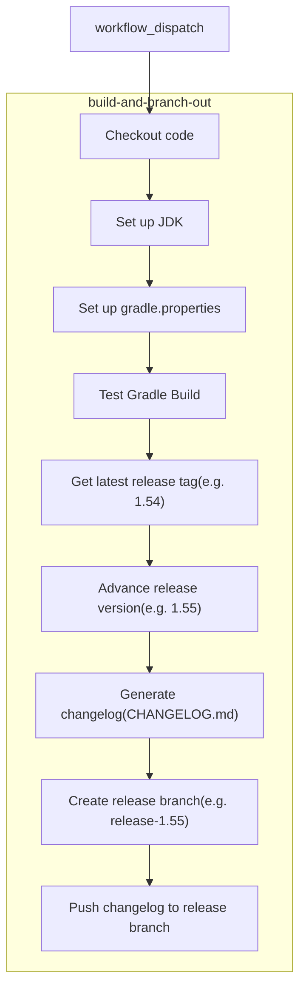

## Overview of the release action

```mermaid
graph TD
    A[workflow_dispatch] --> B1[Checkout code]
    subgraph build-and-branch-out
        B1 --> B2[Set up JDK]
        B2 --> B3[Set up gradle.properties]
        B3 --> B4[Test Gradle Build]
        B4 --> B5["Get latest release tag(e.g. 1.54)"]
        B5 --> B6["Advance release version(e.g. 1.55)"]
        B6 --> B7["Generate changelog(CHANGELOG.md)"]
        B7 --> B8["Create release branch(e.g. release-1.55)"]
        B8 --> B9[Push changelog to release branch]
    end
```
